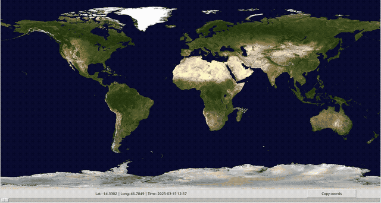

# ISS-Tracker

Prosty program do śledzenia międzynarodowej stacji kosmicznej ISS. Pobiera dane nad jakim skrawkiem Ziemii się aktualnie znajduje i wyświetla graficznie te dane. Program także obsługuje timeline, żeby sprawdzić, gdzie stacja kosmiczna się znajdowała w przeszłości.

## Demo  
  

## Funkcje  
- Pobieranie danych o stacni kosmicznej ISS
- Wyświetlanie aktualnej pozycji na mapie świata
- Timeline pozycji stacji kosmicznej

## Instalacja  
```bash
git clone https://github.com/Bartmannn/ISS-Tracker.git
cd ISS-Tracker 
pip install -r requirements.txt 
python3 main.py
```
